# Deploy project
## Steps:

1. Truy cập vào thư mục /create-web-service
2. Đóng gói project Spring theo lệnh sau:
```terminal
$ mvn clean install -DskipTests 
```
> Download Apache Maven: https://maven.apache.org/download.cgi
3. Trở về thư mục gốc /react-spring-project
4. Deploy project theo lệnh sau
```terminal
$ docker-compose up
```
> Download Docker Desktop: https://www.docker.com/products/docker-desktop

5. Để chạy project, ta vào browser và truy cập tới địa chỉ: http://localhost:3000/ để bắt đầu sử dụng.

# REST API
> Link : http://localhost:8082/create-web-service/swagger-ui.html

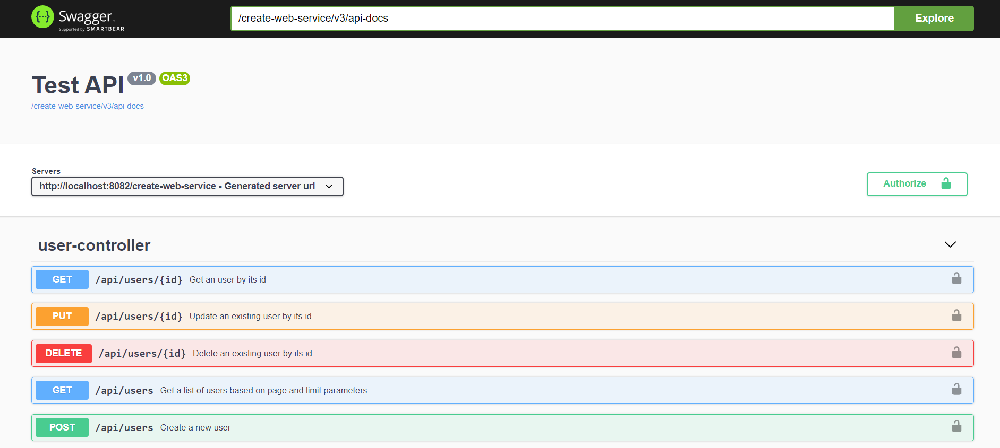

## Sign up for an account

**Request**
```
POST /api/auth/signup
```

**Example 1 : Register with a valid account**

_ Điền thông tin cần đăng ký.

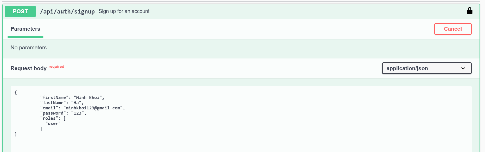

_ Nếu thông tin hợp lệ, đăng ký thành công.

**Response**


**Example 2 :  Email account already exists**

_ Điền thông tin cần đăng ký.

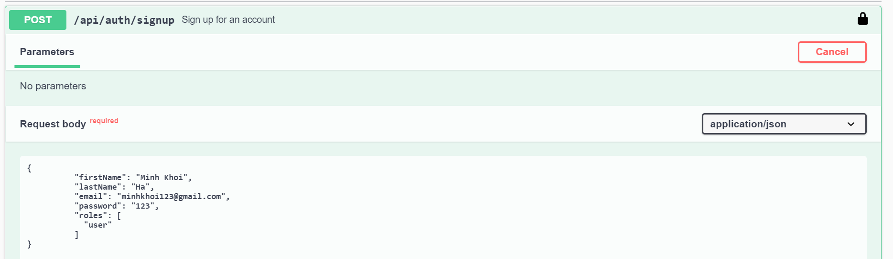

_ Nếu email đã tồn tại trong database, hộp thoại sẽ thông báo email bị trùng.

**Response**
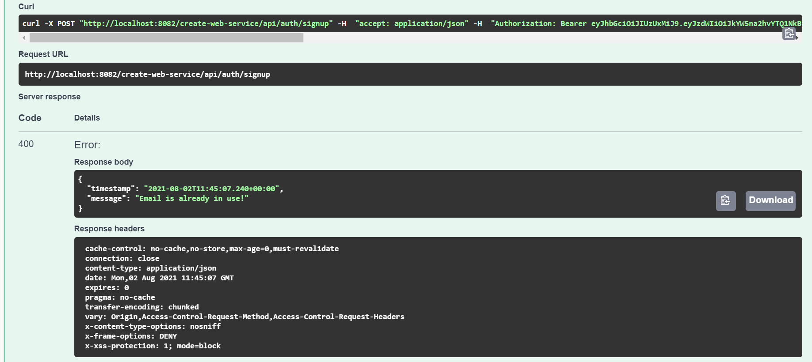

## **Sign in with email and password**

**Request**
```
POST /api/auth/signin
```

**Example 1 :  Logged in successfully**

_ Nhập thông tin đăng nhập.

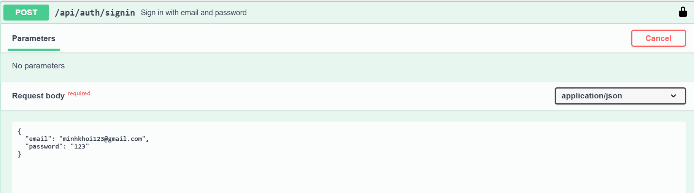

_ Nếu thông tin hợp lệ sẽ đăng nhập thành công.

**Response**
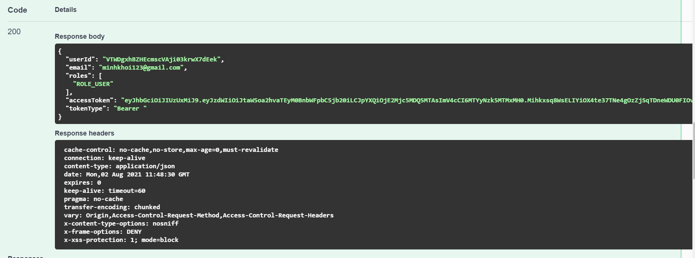

**Example 2 : Login wrong password**

_ Nhập thông tin đăng nhập.

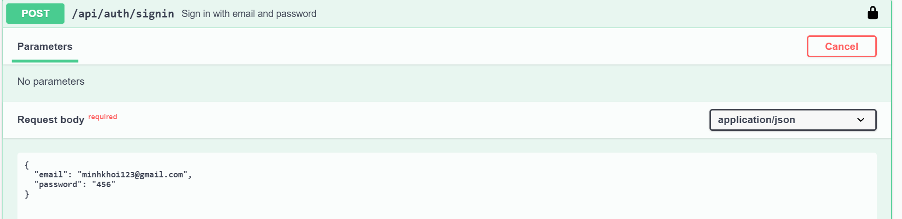

_ Nếu thông tin không hợp lệ, hộp thoại sẽ thông báo sai tài khoản hoặc mật khẩu

**Response**
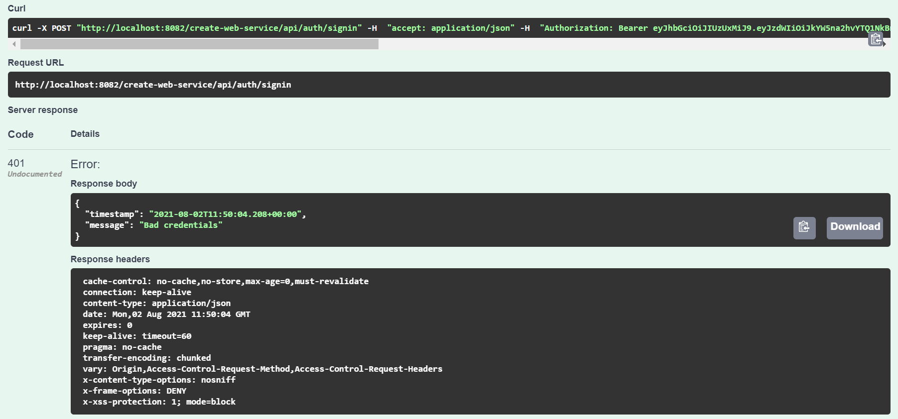

## Authorize with JWT Token (Authorize để thực hiện các API HTTP Request yêu cầu authenticate)

_ Click chọn nút Authorize 

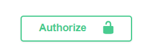

_ Nhập accessToken từ response sau khi đăng nhập thành công
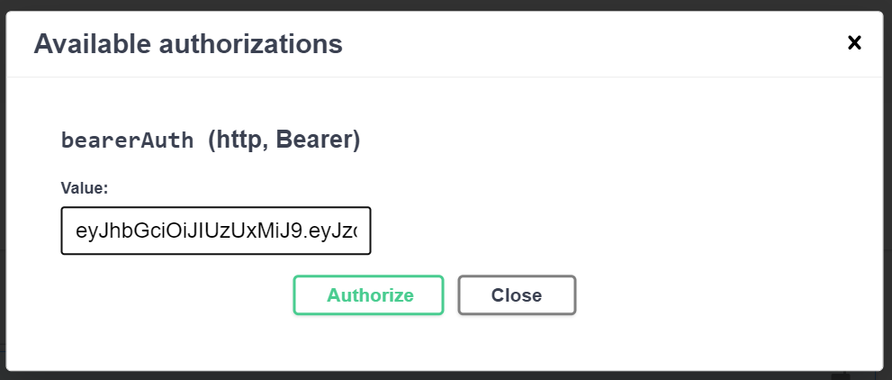

## **Get an user by its id**
  
**Request**
```
GET /api/users/{id}
```
_ Nhập id cần lấy thông tin

**Example 1 : Id exists**
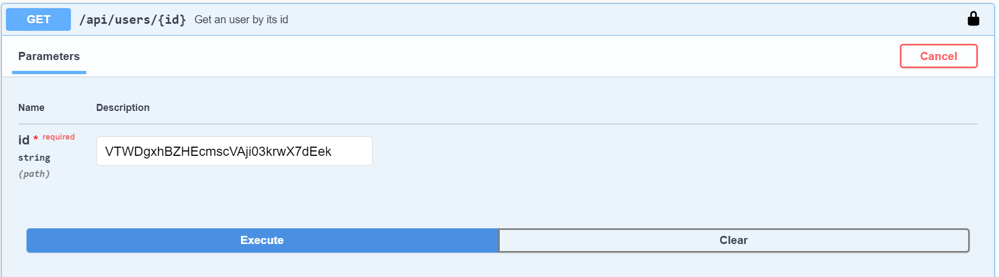

_ Nếu id có tồn tại trong cơ sở dữ liệu, trả về thông tin của user với id trên.

**Response**
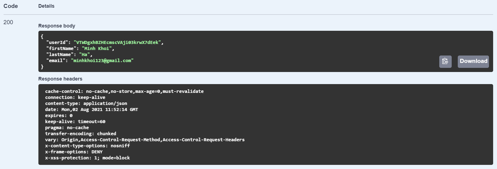

**Example 2 : Id not found**
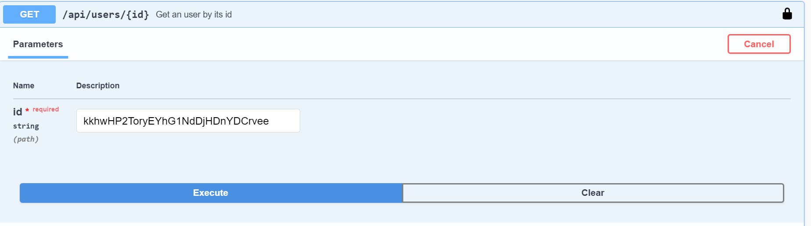

_ Nếu id không tồn tại trong cơ sở dữ liệu, hộp thoại sẽ thông báo không tìm thấy id.

**Response**
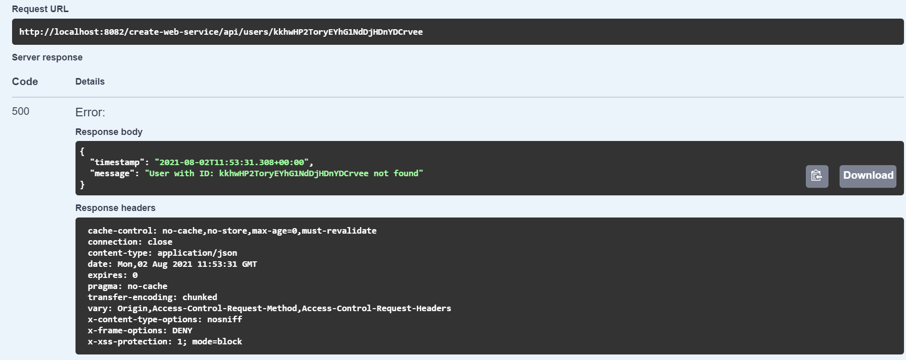
## **Delete an existing user by its id**

**Need to login as admin to delete user**

**Request**
```
DELETE /api/users/{id}
```

_ Nhập vào id cần xoá thông tin

**Example 1 : Id exists**
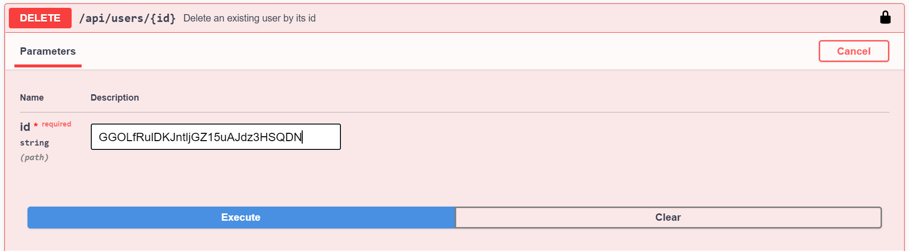

_ Nếu id có tồn tại và có quyền truy cập là admin thì sẽ xoá thành công

**Response**
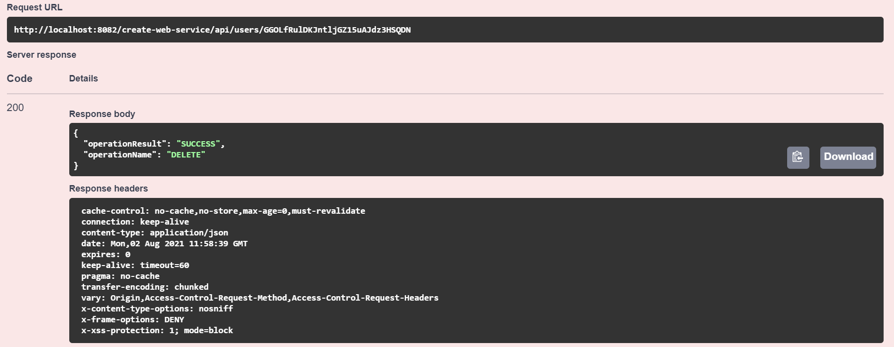
**Example 2 :  Access is denied**

_ Nếu id có tồn tại và nhưng quyền truy cập không phải là admin thì không được phép xoá.

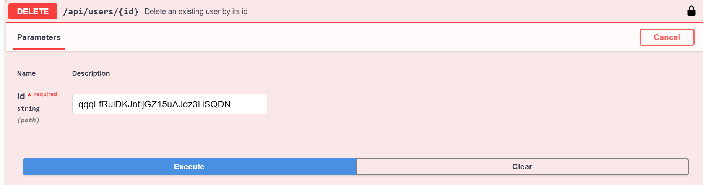
**Response**
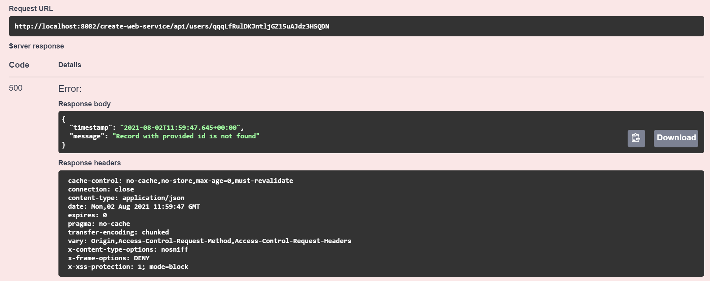
## **Update an existing user by its id**

**Request**
```
PUT /api/users/{id}
```

**Example 1 :  The id exists and the information is valid**

_ Nhập vào id và dữ liệu cần sửa

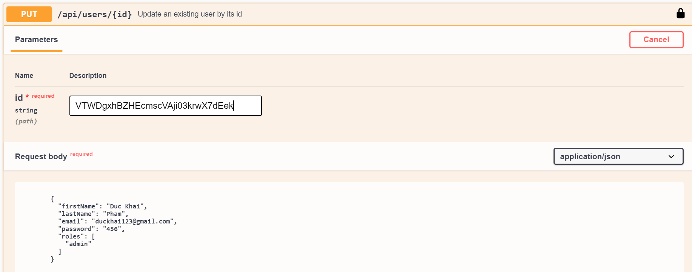

**Response**

_ Nếu id tồn tại và dữ liệu hợp lệ thì sẽ sửa thành công.

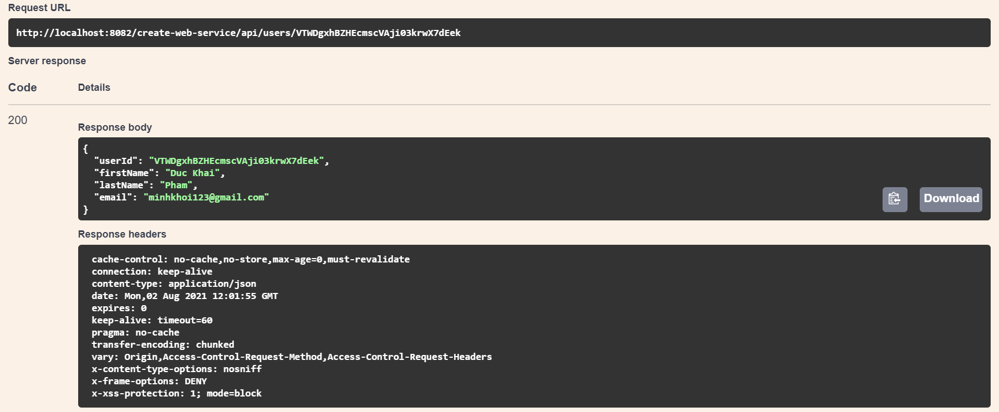
**Example 2 :  Id not found**

_ Nhập vào id và dữ liệu cần sửa

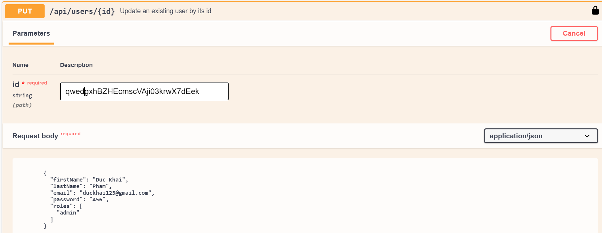

**Response**

_ Nếu không tìm thấy id thì không thể sửa đổi thông tin

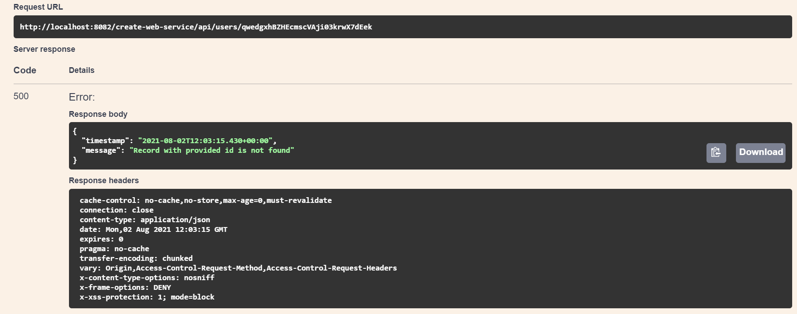